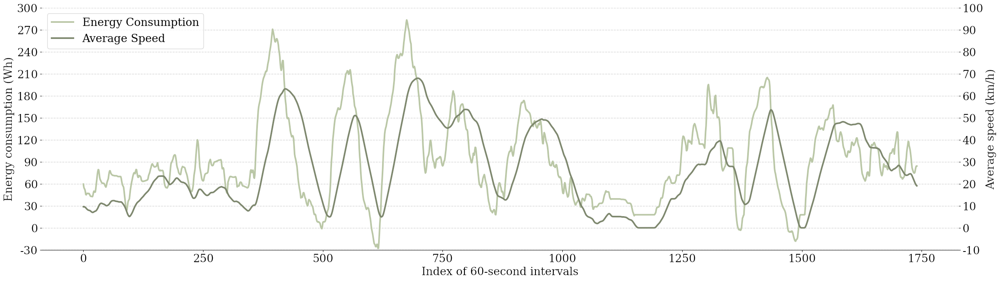
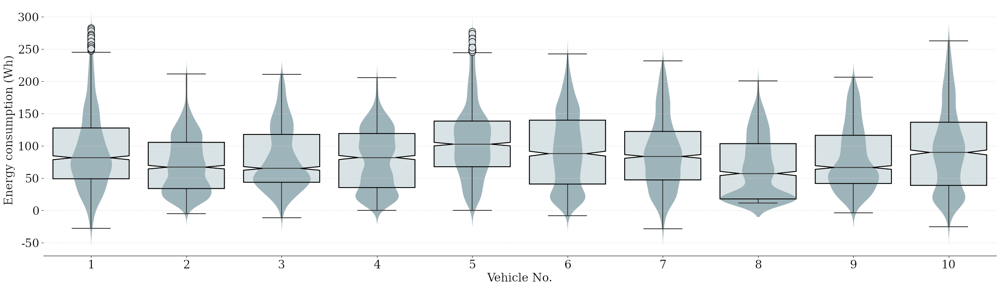

<h2 align="center"> FedBEV Dataset </h2>

<p align="center"> Privacy-Aware Energy Consumption Modeling of Connected Battery Electric Vehicles using Federated Learning </p>

<p align="center">
  <a href="#Data-Source">Data Source</a> | <a href="#Vehicle-Model-Output">Vehicle Model Output</a> | <a href="#Processed-Dataset">Processed Dataset</a> | <a href="https://arxiv.org/abs/2203.14764">Paper</a>
</p>

[](https://opensource.org/licenses/MIT)

---

*Yan, S., Fang, H., Li, J., Ward, T., O'Connor, N. E., & Liu, M. (2022). Privacy-Aware Energy Consumption Modeling of Connected Battery Electric Vehicles using Federated Learning. arXiv preprint arXiv:2203.14764.*

- <a href="https://arxiv.org/abs/2203.14764"> arXiv </a>

If you feel our research and data useful, welcome to cite:

```
@article{yan2023bev,
  title={Privacy-Aware Energy Consumption Modeling of Connected Battery Electric Vehicles using Federated Learning},
  author={Yan, Sen and Fang, Hongyuan and Li, Ji and Ward, Tomas and O'Connor, Noel E and Liu, Mingming},
  journal={arXiv preprint arXiv:2203.14764},
  year={2022}
}
```

# Data Source

The dataset used in our work is sourced from <a href="https://github.com/gsoh/VED"> VED dataset </a>, a real-world dataset collected in Michigan, USA. We filtered 10 trips from VED dataset with a duration longer than 1,800 seconds, and stored them in <a href="./data source"> data source </a> folder.

# Vehicle Model Output

We extracted their GPS coordinates and the altitude data as the input for our vehicle model, with the speed data set as the desired velocity of our vehicle model. The output, consisting of multiple trip attributes such as temperature, actual speed and trip distance, is then used as our training data in <a href="./vehicle model output"> vehicle model output </a> folder. In other words, our dataset is a collection of 10 tables of trip information for all 10 vehicles. Each table includes 1,800 rows and 12 columns, representing different attributes respectively.

We have explored the data for 10 vehicles and have discovered a correlation between their average speed and the total amount of energy consumed during a 60-second interval. For example, the relationship between average speed and energy consumption for Vehicle 1 is shown in the pictures below. It is evident that there is a slight delay in the change in average speed relative to energy usage. Following our analysis, we have determined that this delay is approximately 23 seconds.




# Processed Dataset

## Pre-processing

We divide the data in each 60-second interval, so with a full length of 1,800 seconds, each trip record data is divided into 1741 intervals. Subsequently, standardisation of the data is implemented to shift the distribution such that the mean is zero and the standard deviation is one.

## Feature Selection

We adopted trip attributes, including speed, distance, acceleration and altitude, as trip features, and employed Principal Component Analysis and Random Forest Regression to select features generated by mathematical transformations (e.g., square, logarithm, and exponent). Based on the results, we selected acceleration, speed, the square root of speed, the cube of speed, and the square root of the distance moved in each second as the features for model training.

The processed dataset are stored in <a href="./processed dataset"> processed dataset </a> folder.

---


